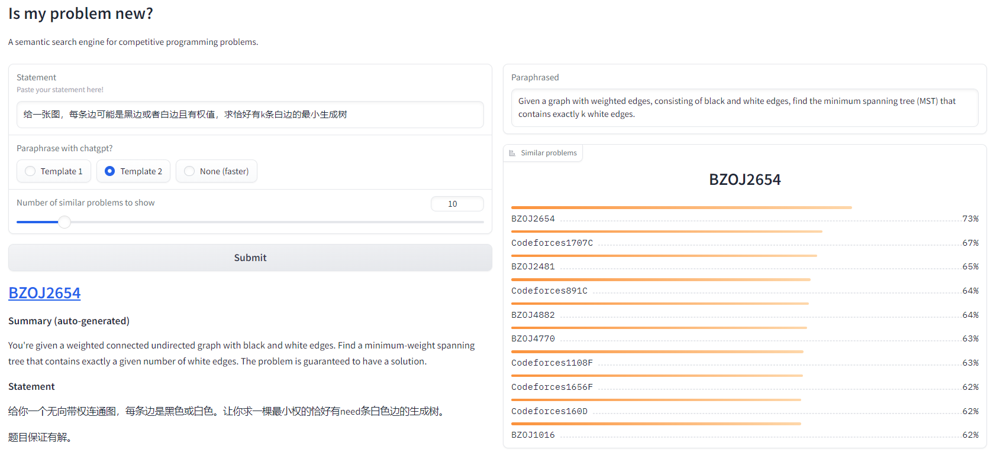
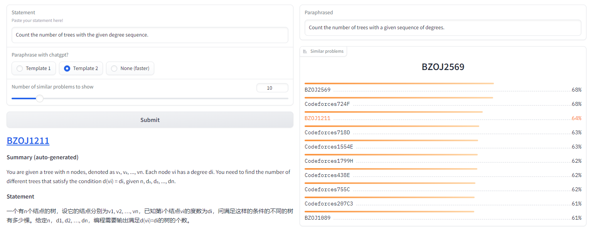
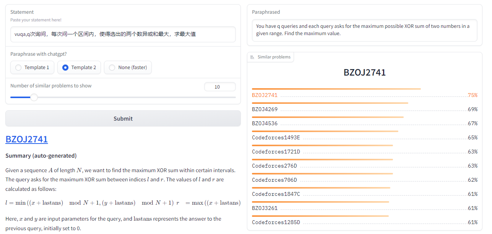

# Is my problem new?
A simple semantic search engine on competitive programming problems.

#### Screenshots

#### How does this work?

This idea is simple: first simplify the statement & remove background etc. by prompting chatgpt, and then embed the documents and queries to perform vector searches. It only happens recently that both models are good and cheap enough.

#### Deploy

You will need API keys from OpenAI (https://platform.openai.com/) and Cohere (https://cohere.com/). The model `gpt-3.5-turbo` (also known as chatgpt) from OpenAI and `Cohere-embed-english-v3.0` from Cohere (empirically works better than OpenAI's embeddings at the same price). You can check their pricing online.

For starters, download summarized problem sets for codeforces & bzoj and embeddings from [here]().

*Can we make this completely open-source?* You will need to replace the summary model and the embedding model with open source versions. For embedding models, [this leaderboard](https://huggingface.co/spaces/mteb/leaderboard) may be a good start.

#### Adding new set of problems

For reference, adding all problems from codeforces & bzoj costs about $20.

*Known issue:* the OpenAI api has a rate limit and currently it is not handled.
